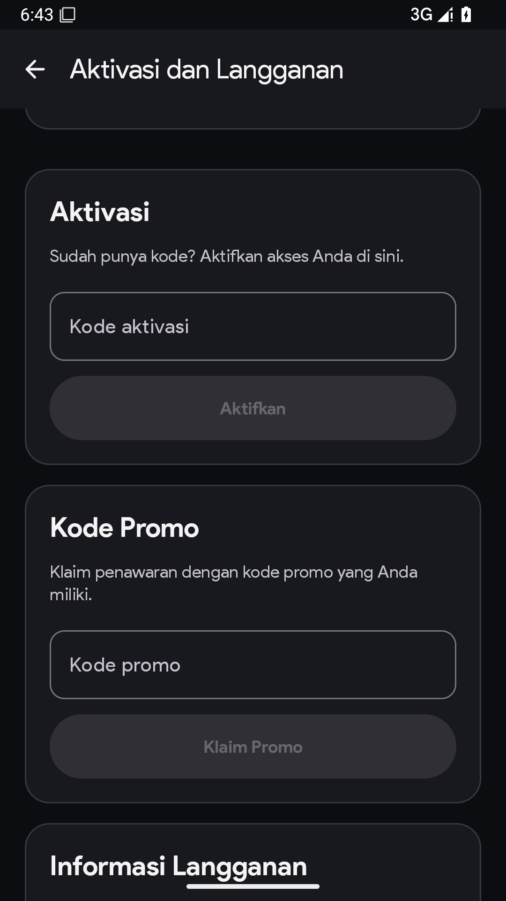
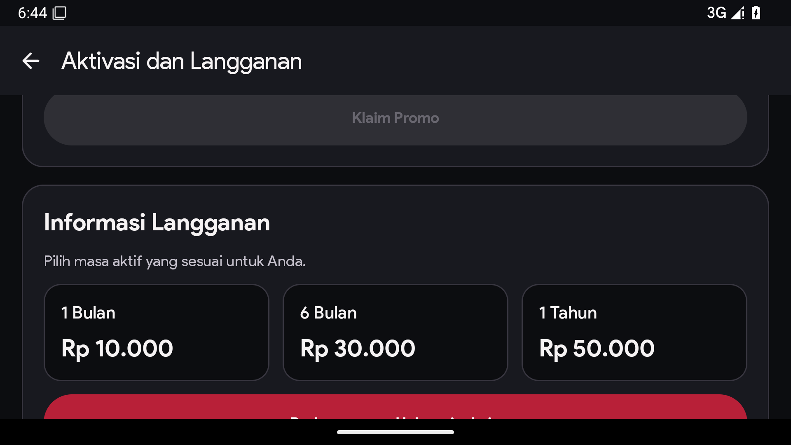
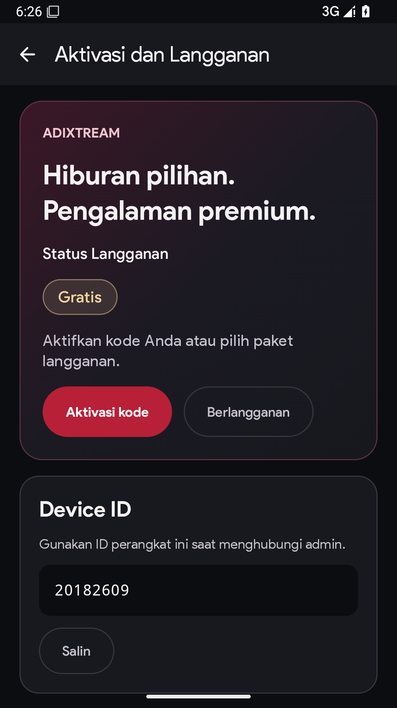
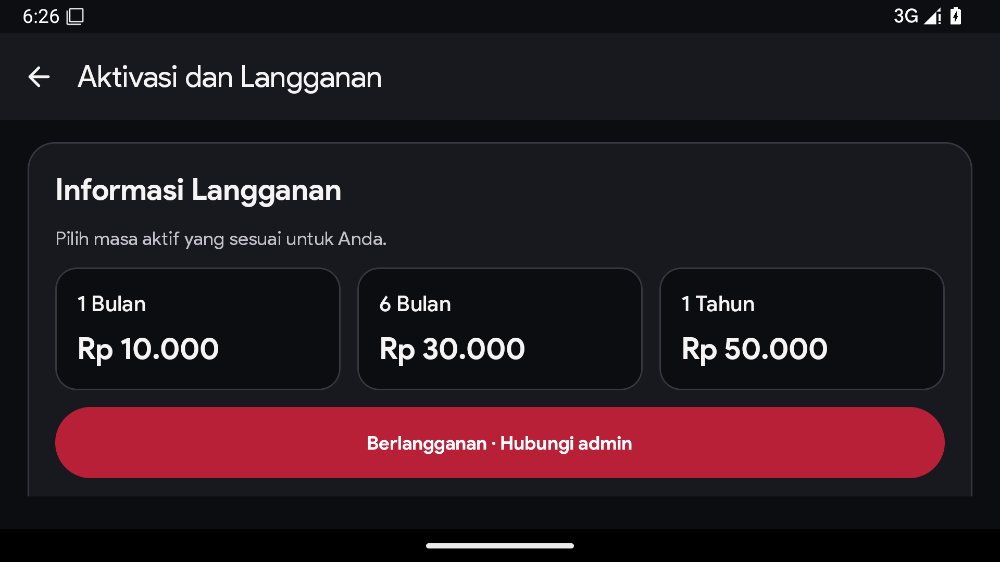
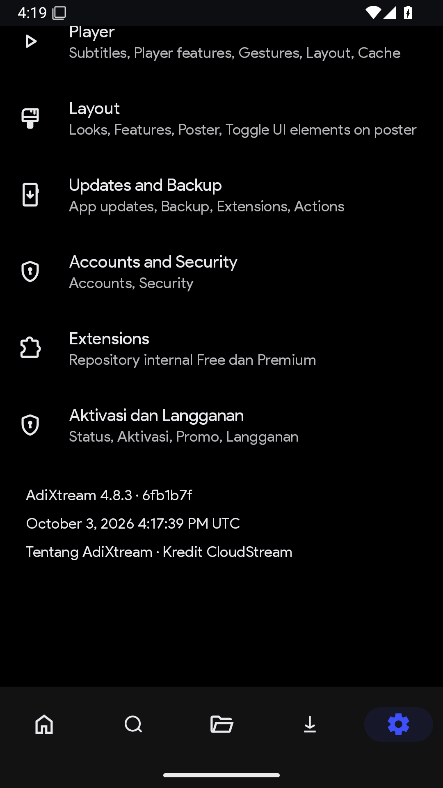
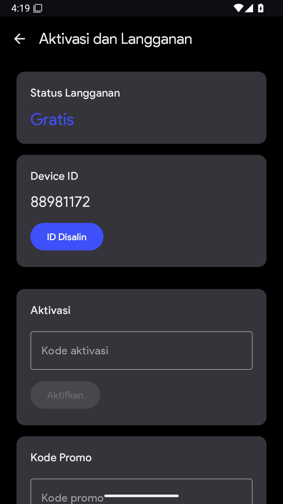
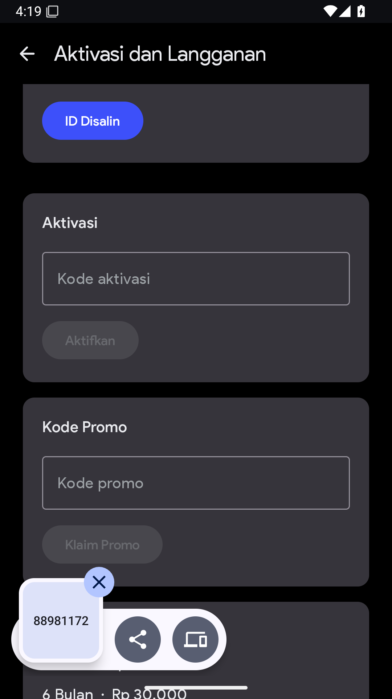
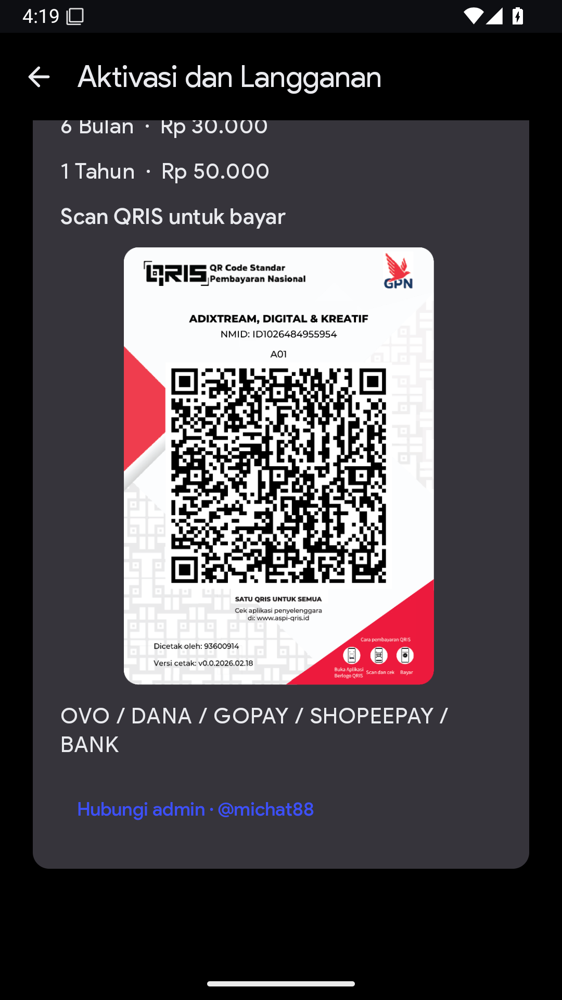
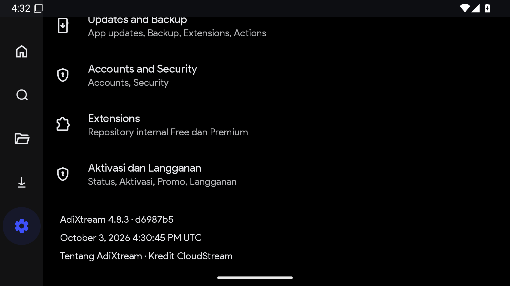
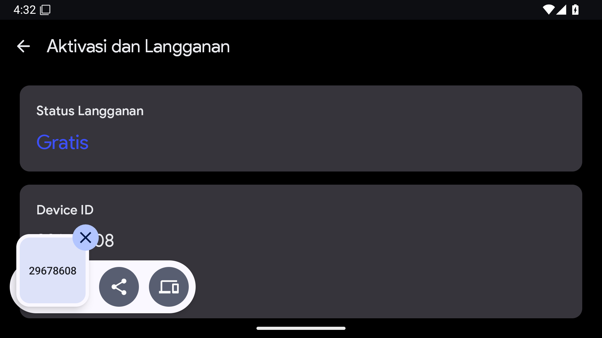

# Emulator screenshots

These are actual Android 15 Pixel 2 AVD captures, not mockups. The debug package
is isolated from production customer storage. Device IDs shown belong to the test
emulator. Main menus use the AVD's English locale; Indonesian resources preserve
the requested Umum/Pemutar/Antarmuka pengguna/Update dan Cadangan/Akun dan Keamanan/
Ekstensi labels. The dedicated AdiXtream subscription labels are Indonesian.

## Final phone/TV validation, source 99c3e1be

[Run 37182941681](https://github.com/michat88/AdiXtream/actions/runs/37182941681)
passed both instrumented methods (2 tests, no failures/errors/skips), including
phone portrait/landscape and TV focus/CTA navigation. Production UI is identical
to 299db626; only the test selectors were corrected. Screenshots capture scroll
positions in a longer page, so adjacent cards can be partly outside the viewport.
They are not evidence of a production-signed build or real license activation.

## Premium dark redesign, source 299db626

Run [37182355161](https://github.com/michat88/AdiXtream/actions/runs/37182355161)
passed clean build, unit/library tests and lint. The complete TV test passed,
including D-pad copy/focus and the new activation/subscribe shortcuts. The phone
method failed because a substring selector matched the hero's descriptive word
“Aktifkan” before reaching the actual button. Commit 99c3e1be makes the action
selector exact; the assertion that an empty code cannot submit remains intact.
The images below are real rendering evidence, not a claim that the whole phone
method passed at 299db626. The emulator's network was blocked; QRIS/backend access
was not tested, and all displayed device IDs belong to the disposable emulator.

## Phone portrait, tested source f4b6fafc

The phone portrait sub-flow reached all menus/build stamp, copied the Device ID,
checked disabled empty-code buttons and reached promo/plans. The containing test
later failed in landscape; see VALIDATION.md. Public QRIS access worked in this
run despite Wi-Fi/data disable commands. No payment, activation or promo was sent.

Android's clipboard overlay appears in the promo capture immediately after the
copy assertion. A screenshot is evidence of rendering, not proof of production
license, upgrade or backend behavior.

## Phone landscape, tested source e761ba3a

The full phone portrait/landscape test passed on this source. The TV method still
failed a capture-bounds assertion; its prior D-pad actions passed, but the method
is not counted as passed. These selected images cover the verified phone flow.

PR-triggered CI checks out GitHub's temporary merge commit, so the on-screen build
stamp may show that merge SHA rather than the migration branch's source SHA.
